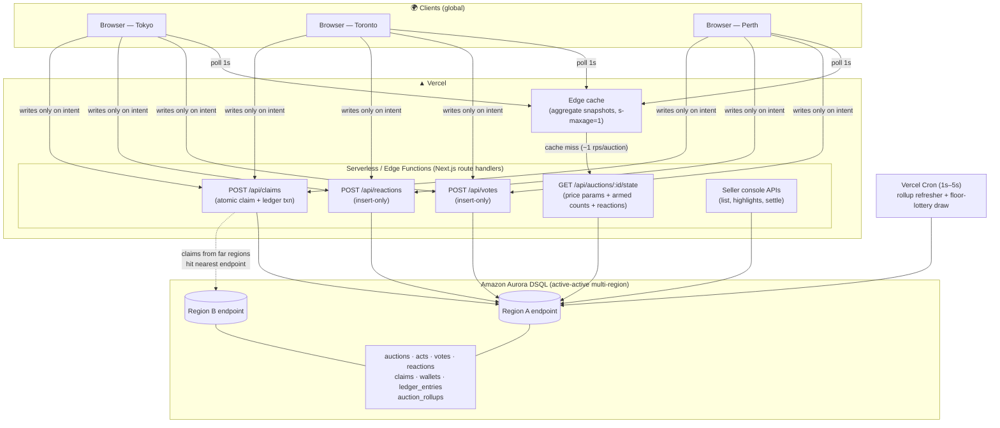
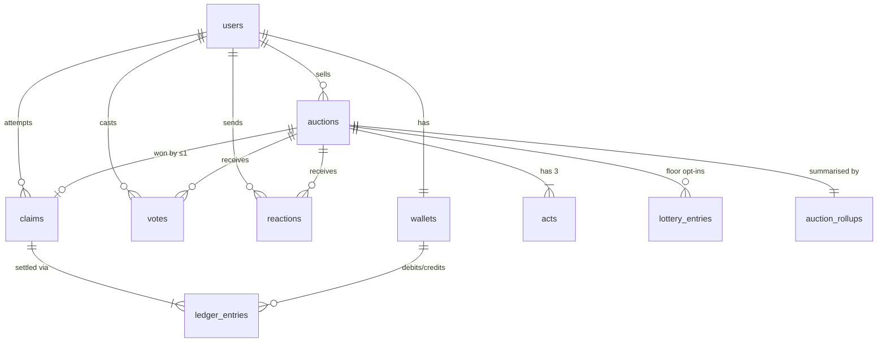
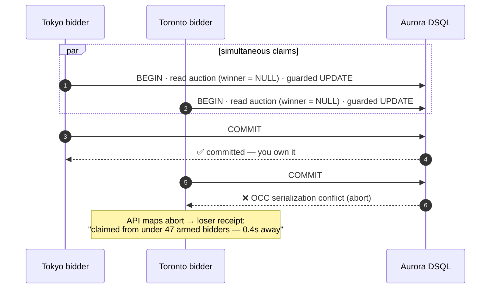

# Architecture

> **Stack:** Next.js (v0-scaffolded) on Vercel · **Amazon Aurora DSQL** (multi-region,
> active-active) · Edge-cached aggregate polling for realtime feel.

## The three architectural theses

1. **The price never touches the database.** Price is a deterministic function
   `price(t) = f(start_price, duration, reserve, pause_windows, demand_brake, t)` of
   published auction parameters. Clients compute it locally against a server clock
   offset.
   The database stores *events* (votes, reactions, claims) and *facts* (auctions,
   ledger) — never ticks.

2. **Reads are cached; only intent writes.** "Realtime" is 1-second polling of a tiny
   aggregate JSON served from Vercel's edge cache (`Cache-Control: s-maxage=1`).
   A million concurrent viewers generate ~1 origin request per second per auction.
   Only votes, reactions, and claims write to DSQL.

3. **Strong consistency is the product, not the plumbing.** The fairness promise —
   one global price, one true armed counter, exactly one winner — is only honest with
   multi-region strongly consistent writes. That is precisely Aurora DSQL's
   active-active guarantee. DynamoDB global tables replicate asynchronously across
   regions and could double-award a claim; we ruled it out for that reason.

---

## System diagram



**The demo money-shot this enables:** two browsers in two regions claim the same item
in the same second — DSQL commits exactly one, and the loser instantly sees the
"you were 0.4s away" receipt. No coordination service, no locks, no queue: one SQL
transaction.

---

## Data model



Key design decisions (full DDL in [`db/schema.sql`](../db/schema.sql)):

| Decision | Why |
|---|---|
| **UUID PKs, generated app-side** | DSQL has no sequences/`SERIAL`; UUIDs also avoid cross-region coordination |
| **No FK constraints, no triggers** | Not supported in DSQL; referential integrity enforced in the app layer and documented per table |
| **`votes` / `reactions` are insert-only** | Inserts don't conflict under optimistic concurrency. A counter `UPDATE` on a hot auction row would cause OCC retry storms — the classic DSQL anti-pattern |
| **`auction_rollups` summary row, single writer** | A cron job (one writer → no contention) re-aggregates counts every 1–5s into one row per auction; the public state endpoint reads only this row |
| **Winner column on `auctions`, claim by conditional UPDATE** | The whole game compiles down to one guarded write (below) |
| **Double-entry `ledger_entries`** | Every settlement writes balanced debit/credit rows; wallet balance is a constraint-checked cached value. Auditable money, even when the money is demo coins |

---

## The claim transaction (the centerpiece)

All claim logic is **server-authoritative** and lives in one DSQL transaction:

```sql
BEGIN;

-- 1. Lock in the facts (single consistent snapshot)
SELECT a.status, a.start_price, a.reserve_price, a.decay_params,
       a.winner_user_id, w.balance
FROM auctions a, wallets w
WHERE a.id = $auction_id AND w.user_id = $user_id;

-- 2. Server computes authoritative price from decay params + NOW(),
--    validates: status = 'live', winner IS NULL, price > reserve,
--    bidder tier delay satisfied (votes counted from votes table),
--    balance >= price.

-- 3. The guarded write — the entire game in one statement:
UPDATE auctions
SET    winner_user_id = $user_id,
       winning_price  = $server_price,
       claimed_at     = NOW(),
       status         = 'claimed'
WHERE  id = $auction_id
  AND  winner_user_id IS NULL;        -- ← the condition that makes one winner

-- 4. If (and only if) step 3 affected 1 row: settle atomically.
INSERT INTO claims (id, auction_id, user_id, price, result) VALUES (...,'won');
INSERT INTO ledger_entries (...) VALUES   -- double-entry, all-or-nothing
  (buyer_wallet,  -price,          'item_purchase'),
  (seller_wallet, +price - fees,   'item_sale'),
  (platform_wallet, +base_fee,     'commission'),
  (platform_wallet, +spread_fee,   'spread_bonus');
UPDATE wallets SET balance = balance - $price WHERE user_id = $user_id;
UPDATE wallets SET balance = balance + $net   WHERE user_id = $seller_id;

COMMIT;
```

**Concurrency story:** two simultaneous claims race. Under DSQL's optimistic
concurrency control, both transactions read `winner_user_id IS NULL`; the first to
commit wins; the second **aborts with a serialization conflict at commit**. We don't
treat that abort as an error — *the OCC conflict is the game's "someone beat you"
signal*. The losing request maps the abort to the loser receipt
(`beaten_by_ms`, `armed_count_at_loss`). The concurrency model isn't an obstacle
we engineered around; it's the referee.



**Retry policy:** claims are *never* retried (an abort means you lost — that's the
game). Votes/reactions are inserts and retried up to 3× with jitter on transient
conflicts. The rollup writer is a single cron, so it never conflicts with itself.

---

## Write-path patterns (DSQL-specific)

| Path | Pattern | Contention profile |
|---|---|---|
| Vote | `INSERT INTO votes` with `UNIQUE (auction_id, user_id, act_no)` for idempotency | Insert-only → no hot row |
| Reaction | `INSERT INTO reactions` (no uniqueness; bursty by design) | Insert-only → no hot row |
| Armed counter | Computed on read from `votes` (count per user → tier); surfaced in lobby / room / `state` | Read-time aggregate → no writer |
| Claim | Guarded `UPDATE ... WHERE winner_user_id IS NULL` + ledger | Intentionally contended — exactly one survives |
| Demand brake | `burn_level` ratcheted up at armed milestones (5/15/30) by the votes/bots routes, with an effective-from timestamp; the price function reads it as a sub-1 multiplier that *slows* decay | Monotonic, single writer per step |
| Floor resolution | Lazy on `state` read (no cron): once price ≤ reserve and unclaimed, `floor_action` decides — `lottery` draws a fully-armed entrant and settles via the claim path, or `withdraw` sets `status='unsold'` (relistable). Guarded `UPDATE` → one outcome | OCC-guarded |

**Clock discipline:** clients fetch a server-time offset once (and on refocus) and
render the price from `server_now = local_now + offset`. Authoritative pricing at
claim time is computed inside the transaction from `NOW()` — a tampered client clock
changes pixels, never outcomes.

---

## Realtime feel without websockets

Vercel functions don't hold sockets, and we don't need them:

- `GET /api/auctions/:id/state` returns ≤1 KB: decay params (incl. demand-brake
  level + pause windows), armed counts by tier (computed from `votes`), spectator
  estimate, status/winner. It also lazily resolves the floor (lottery/withdraw)
  when the price has reached the reserve unclaimed.
- `Cache-Control: public, s-maxage=1, stale-while-revalidate=1` → the edge absorbs
  the polling fleet.
- Claims/votes return fresh state in their response body, so actors see their own
  effect instantly (read-your-writes UX) even though the crowd is on a 1s cadence.
- Stretch (not required for fairness): upgrade the room to SSE via a small relay.
  Fairness never depends on push — only on the claim transaction.

## Security model (demo scope)

- Server-authoritative price, tiers, timing, and balances — the client is a renderer.
- Email-verified accounts; one vote per account per act enforced by unique index.
- Rate limits on write endpoints (per-account and per-IP) so the armed counter
  stays meaningful.
- Idempotent claim endpoint (idempotency key) — double-click safe.
- Demo coins only; no real payments, goods, or PII beyond email.

## Production hardening roadmap *(identified, deliberately not built)*

- Stripe Connect for wallet top-ups/payouts (platform never holds funds directly);
  KYC at payout.
- Marketplace-facilitator legal review — auction/distance-selling rules vary by
  jurisdiction; geo-gated launch. Design already avoids the pay-to-bid (penny
  auction / gambling) category: claim rights cost attention, not money.
- Shill-demand defenses: payment-verified arming, per-listing anomaly detection on
  vote velocity and account age.
- Moderation pipeline if free-text chat ever ships (launch design uses emoji +
  canned phrase chips precisely to keep the public surface unmoderatable-content-proof).
- Disputes/refunds, ToS/privacy, observability (structured logs → metrics on claim
  conflict rates, rollup lag, cache hit ratio).
